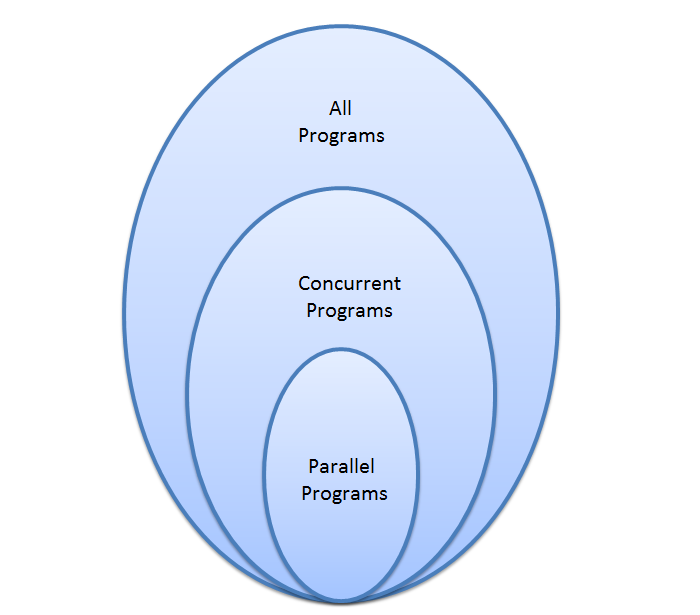
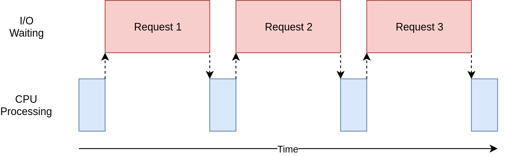
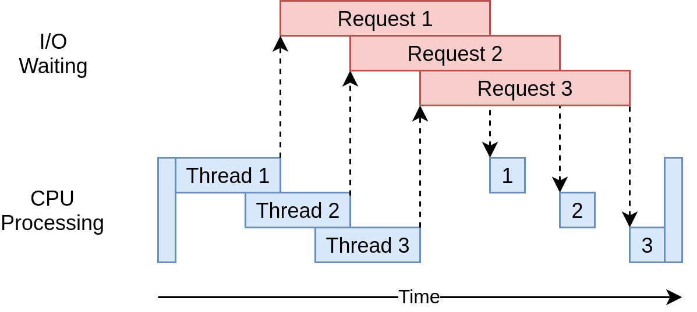
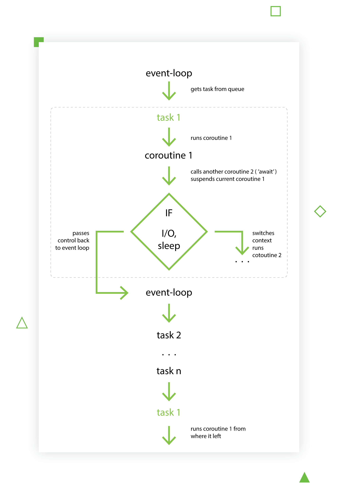
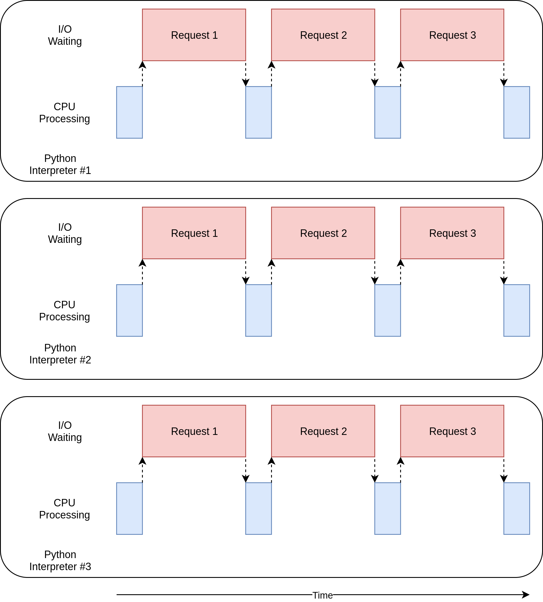
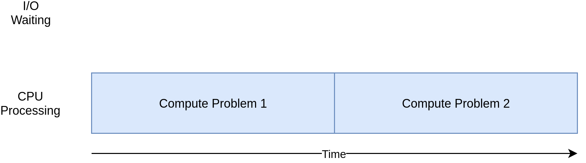
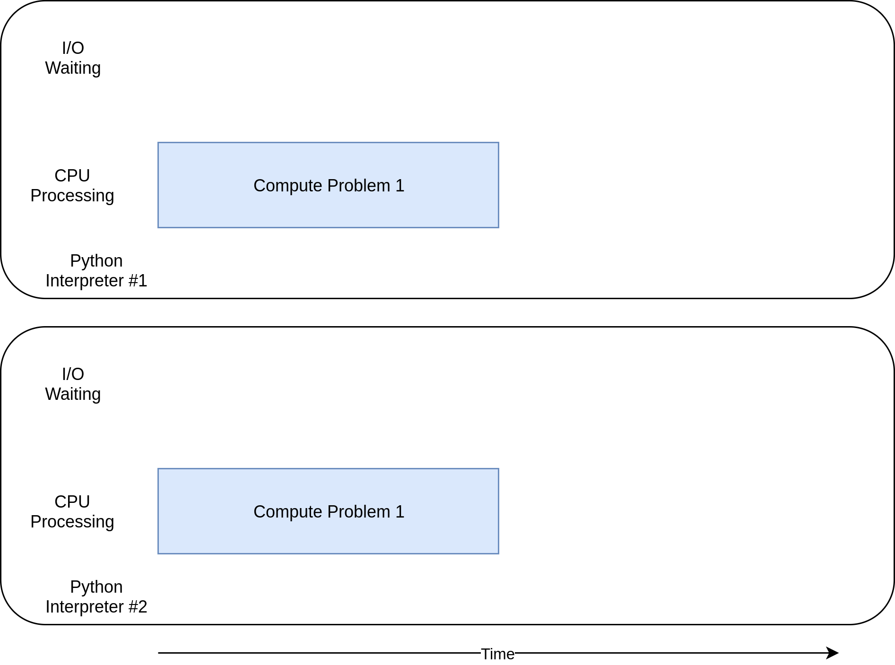

# Mali pregled problema konkurentnog programiranja

## Kada je pravo vreme za optimizaciju
- Sekvencijalne verzija koda je napisana
- Nismo zadovoljni performansama 
(program drugo traje, previše memorijskih resursa koristi, 
nedovoljno koristi procesorska jezgra)
- Profajliranjem utvrdimo koji delovi koda nisu optimalni
- Koliko se često program koristi?
- Koliki je procenat neoptimalnog koda?
- Koliko je vremena neophodno za optimizaciju?
- Kolike su koristi od optimizacije?
- Voditi računa da je "prerana optimizacija izvkorenor svakog zla"
 ([Donald Knuth](http://wiki.c2.com/?PrematureOptimizationhttp://wiki.c2.com/?PrematureOptimizationhttp://web.archive.org/web/20130731202547/http://pplab.snu.ac.kr/courses/adv_pl05/papers/p261-knuth.pdf))
 )

## Konkurentno VS Paralelno programiranje
- Konkurentno programiranje - pisanje koda takvog da se njegovi delovi mogu nezavisno izvršavati
- Konkurentnost - postojanje i kompozicija nezavisnih izvršnivivivih jedinica 
- U zavisnosti od nivoa apstrakcije, izvršne jedinice mogu biti: delovi koda, niti, procesi
- Paralelizam - simultano izvršavanje računanja (engl. *computation*), tj. izvršnih jedinica
- Paralelno programiranje je podskup konkurentnog programiranja.




## Konkurentno i paralelno programiranje u Python-u
- Konkurentno programiranje je moguće upotrebom dve biblioteke: 
[*threading*](https://docs.python.org/3/library/threading.html) i [*asyncio*](https://docs.python.org/3/library/asyncio.html)
- Paralelno programiranje je moguće upotrebom biblioteke: [*multiprocessing*](https://docs.python.org/3.4/library/multiprocessing.html?highlight=process)
- Pre nego što krenemo sa pregledom prethodno pomenutih biblioteka, potrebno je objasniti
kada je koju biblioteku dobro koristiti, a kada ne. To će biti urađeno kroz par praktičnih primera.


## I/O Bound programi
- I/O Bound programi najviše vreme provedu blokirani I/O operacijama (mreža, disk, itd.)
- Mogu se ubrzati preplitanjem vremena čekanja


### Skidanje sadržaja sa interneta (sekvencijalna/sinhrona implementacija)

```python
#!/usr/bin/env python3
import time

import requests


def download_site(url, session):
    with session.get(url) as response:
        print(f"Read {len(response.content)} from {url}")


def download_all_sites(sites):
    with requests.Session() as session:
        for url in sites:
            download_site(url, session)


if __name__ == "__main__":
    sites = [
                "http://www.jython.org",
                "http://olympus.realpython.org/dice",
            ] * 80
    start_time = time.time()
    download_all_sites(sites)
    duration = time.time() - start_time
    print(f"Downloaded {len(sites)} in {duration} seconds")

# file: code/io_non_concurrent.py
# Output:
# Downloaded 160 in 25.110293865203857 seconds

```

### Skidanje sadržaja sa interneta upotrebom *threading* biblioteke
- *Pre-emptive multitasking* - operativni sistem određuje kada će doći do zamene zadataka
- Zahvaljujući GIL-u (Global Interpreter Lock) samo jedna nit može da izvršava 
Python interpreter
- Nit može biti u bilo kom trenutka prekinuta i zamenjena drugom (čak i usred naredbe), 
što dovodi do štetnog preplitanja.
- Voditi računa da ne dođe do trke do podataka ili *deadlock*-a

```python

#!/usr/bin/env python3
import concurrent.futures
import threading
import time

import requests

thread_local = threading.local()


def get_session():
    if not getattr(thread_local, "session", None):
        thread_local.session = requests.Session()
    return thread_local.session


def download_site(url):
    session = get_session()
    with session.get(url) as response:
        print(f"Read {len(response.content)} from {url}")


def download_all_sites(sites):
    with concurrent.futures.ThreadPoolExecutor(max_workers=5) as executor:
        executor.map(download_site, sites)


if __name__ == "__main__":
    sites = [
                "http://www.jython.org",
                "http://olympus.realpython.org/dice",
            ] * 80
    start_time = time.time()
    download_all_sites(sites)
    duration = time.time() - start_time
    print(f"Downloaded {len(sites)} in {duration} seconds")


# file: code/io_threading.py
# Output: 
# Downloaded 160 in 4.013232469558716 seconds

```

- Niti se prepliću, čime se prepliće i njihovo čekanje, te otuda dolazi do ubrzanja rada programa


### Skidanje sadržaja sa interneta upotrebom *asyncio* biblioteke 
- Cooperative multitasking - zadatak odlučuje kada predaje kontrolu drugom zadatku ili petlji događaja 
- *Event loop* - (bes)konačna petlja koja kontroliše kada će se koji zadatak izvršiti

- Zadaci izvršavaju korutine
- Korutine su (banalno rečeno) funkcije koje imaju mogućnost da se njihovo izvršavanje suspenduje,
a kasnije i ponovo nastavi. Liče na generatore, ali se namere zbog kojih se koriste razlikuju. Za njih
se može reći da su generatori koji konzumiraju podatke, ali ih ne generišu
- Korutina sa namerom (čeka rezultat blokirajuće operacija) predaje kontrolu izvršavanja 
*event loop*-u, te nema štetnog preplitanja.

```python
#!/usr/bin/env python3
import asyncio
import time
import aiohttp


async def download_site(session, url):
    async with session.get(url) as response:
        print("Read {0} from {1}".format(response.content_length, url))


async def download_all_sites(sites):
    async with aiohttp.ClientSession() as session:
        tasks = []
        for url in sites:
            task = asyncio.ensure_future(download_site(session, url))
            tasks.append(task)
        # automatski svaku korutinu zapakuje u zadatak
        # rezultat je agregirana lista povratnih vrednosti
        await asyncio.gather(*tasks, return_exceptions=True)


if __name__ == "__main__":
    sites = [
                "http://www.jython.org",
                "http://olympus.realpython.org/dice",
            ] * 80
    start_time = time.time()
    asyncio.get_event_loop().run_until_complete(download_all_sites(sites))
    duration = time.time() - start_time
    print(f"Downloaded {len(sites)} sites in {duration} seconds")

# file: code/io_asyncio.py
# Output:
# Downloaded 160 sites in 1.2502310276031494 seconds
```
- Radi brže i skalira bolje od *threading*-a, jer nema *overhead*-a u zameni konteksta niti
- Sve se izvršava u jednoj niti na jednom CPU
- Sve biblioteke koje se koriste moraju imati podršku za komunikaciju sa *event loop*-om.
- Svi zadaci moraju biti kooperativni, inače će jedan zadatak izgladneti ostale (time.sleep VS asyncio.sleep).


### Skidanje sadržaja sa interneta upotrebom *multiprocessing* biblioteke 
- Svaki proces pokreće poseban interpretera. Ova operacija je dosta skuplja od pokretanja niti.
- Svaki proces ima svoju memoriju. Razmena podataka se odvija putem posebnih protokola za 
međuprocesnu komunikaciju.
```python
#!/usr/bin/env python3
import requests
import multiprocessing
import time

session = None


def set_global_session():
    global session
    if not session:
        session = requests.Session()


def download_site(url):
    with session.get(url) as response:
        name = multiprocessing.current_process().name
        print(f"{name}:Read {len(response.content)} from {url}")


def download_all_sites(sites):
    with multiprocessing.Pool(initializer=set_global_session) as pool:
        pool.map(download_site, sites)


if __name__ == "__main__":
    sites = [
        "http://www.jython.org",
        "http://olympus.realpython.org/dice",
    ] * 80
    start_time = time.time()
    download_all_sites(sites)
    duration = time.time() - start_time
    print(f"Downloaded {len(sites)} in {duration} seconds")
    
# file: code/io_mp.py
# Output:
# Downloaded 160 in 6.127354621887207 seconds    
```

- Slabije skalira od *threading*-a i *asyncio*-a zbog *overhead*-a koji nastaje pri kreiranju
procesa. 

## CPU Bound programi
- CPU Bound programi najviše vremena provedu računajući.
- CPU je prezauzet i obično ga nema dovoljno
- Ovakvi programi se mogu ubrzati povećanjem procesorske moći i njenim pravilnim iskorišćavanjem.


### Suma kvadrata n-prirodnih brojeva (sekvencijalna implementacija)
```python
#!/usr/bin/env python3
import time


def cpu_bound(number):
    return sum(i * i for i in range(number))


def find_sums(numbers):
    for number in numbers:
        cpu_bound(number)


if __name__ == "__main__":
    numbers = [5_000_000 + x for x in range(20)]

    start_time = time.time()
    find_sums(numbers)
    duration = time.time() - start_time
    print(f"Duration {duration} seconds")

# file: code/cpu_non_concurrent.py
# Output:
# Duration 9.686283349990845 seconds    
```

### Suma kvadrata n-prirodnih brojeva upotrebom *multiprocessing* biblioteke
```python
#!/usr/bin/env python3
import multiprocessing
import time


def cpu_bound(number):
    return sum(i * i for i in range(number))


def find_sums(numbers):
    with multiprocessing.Pool() as pool:
        pool.map(cpu_bound, numbers)


if __name__ == "__main__":
    numbers = [5_000_000 + x for x in range(20)]

    start_time = time.time()
    find_sums(numbers)
    duration = time.time() - start_time
    print(f"Duration {duration} seconds")

# file: code/cpu_mp.py
# Output:
# Duration 5.823425769805908 seconds
```



- Obično se dobri rezultati postižu kada se svakom CPU-u dodeli po jedan proces. 
- Više procesa od CPU-ova dovodi do nepotrebne komutaciju procesa.
- Nekada se bolji rezultati dobijaju kada se smanji broj procesa, jer nema dovoljno posla.
- U zavisnosti od problema koji se rešava, povećanje broja procesa ne donosi
 uvek bolje rezultate.
- Kada se bira broj procesa i/ili broj CPU-ova, dobro je teorijski se osloniti na 
jako i slabo skaliranje, a zatim empirijski utvrditi najbolju konfiguraciju

### Suma kvadta n-prirodnih brojeva upotrebom *threading* i *asyncio* biblioteke
- S obzirom da nema blokirajućih operacija, upotreba *asycio* nema smisla.
- Zbog ogreničenja GIL-a, nema smisla koristiti *threading*.

## Preporuka
- Za optimizaciju CPU Bound programa koristiti *multiprocessing* ili C/C++.
- Za optimizaciju I/O Bound programa Python community preporučuje: 
"Use asyncio when you can, threading when you must." 

## Literatura
- https://realpython.com/python-concurrency/
- https://github.com/realpython/materials/tree/master/concurrency-overview
- https://snarky.ca/how-the-heck-does-async-await-work-in-python-3-5/
- https://en.wikipedia.org/wiki/Coroutine
- https://djangostars.com/blog/asynchronous-programming-in-python-asyncio/
